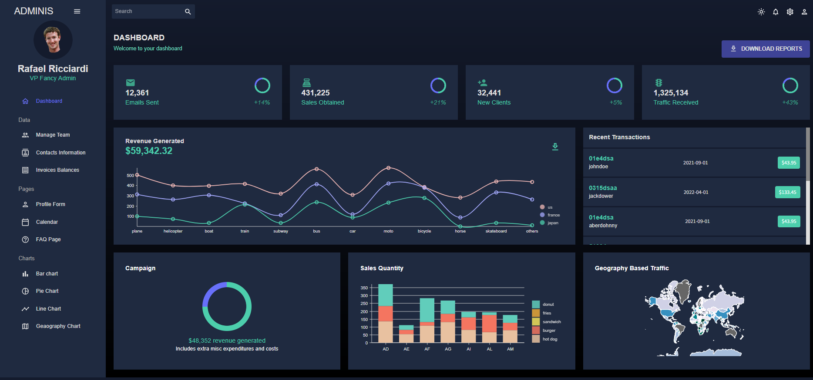
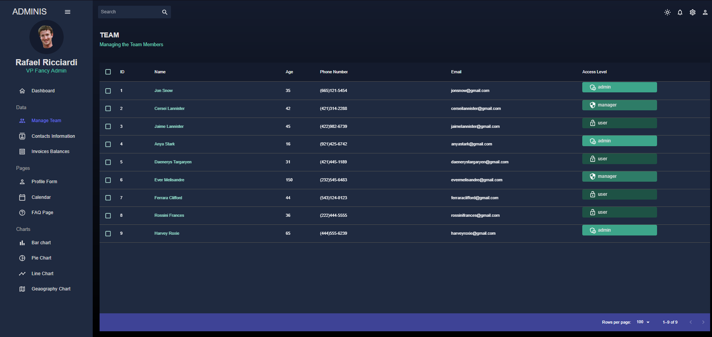
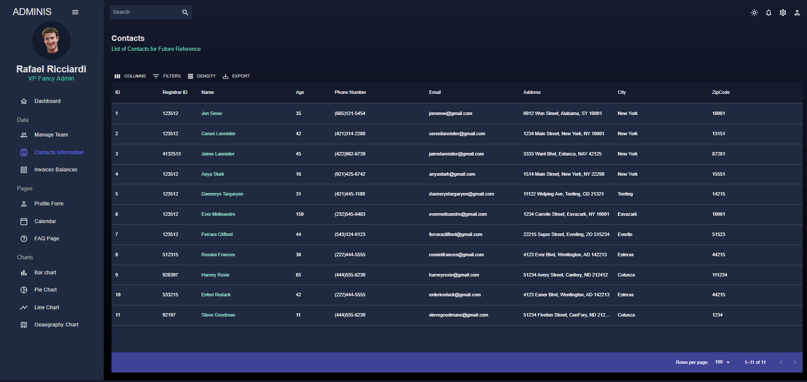
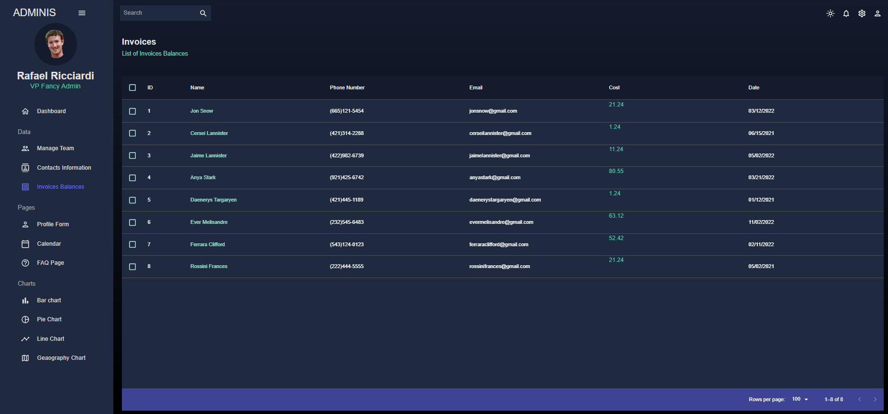
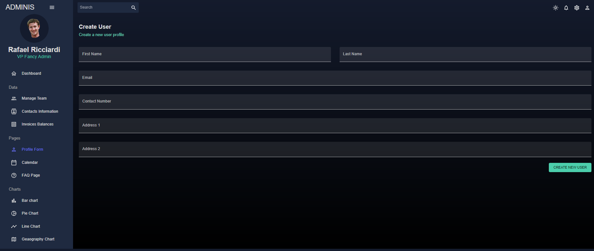
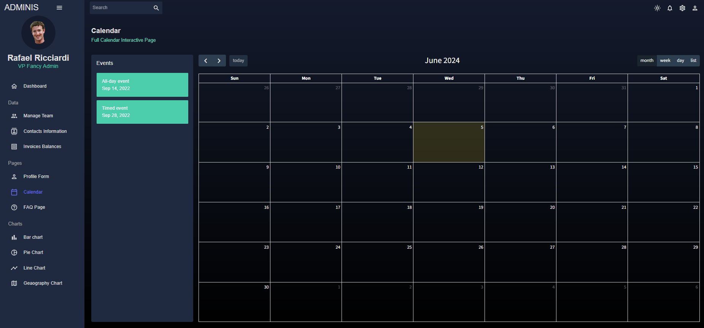
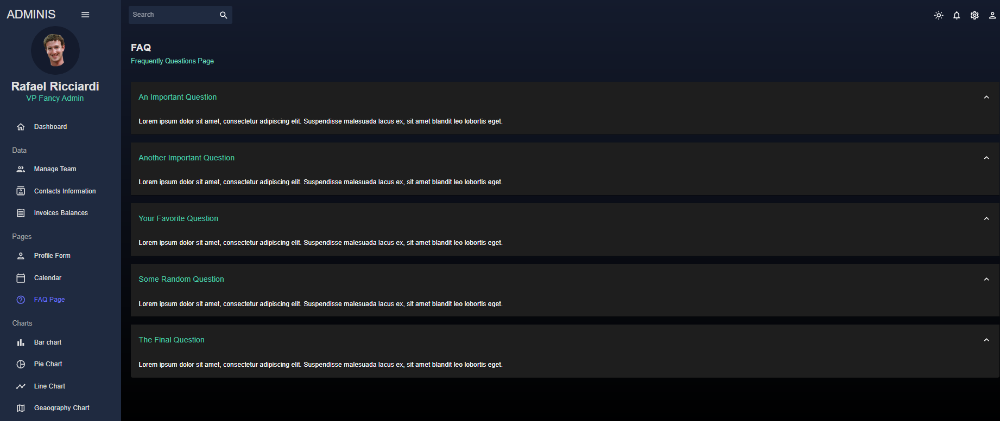
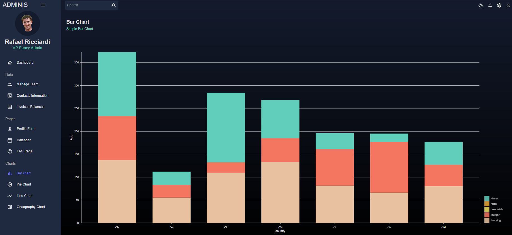
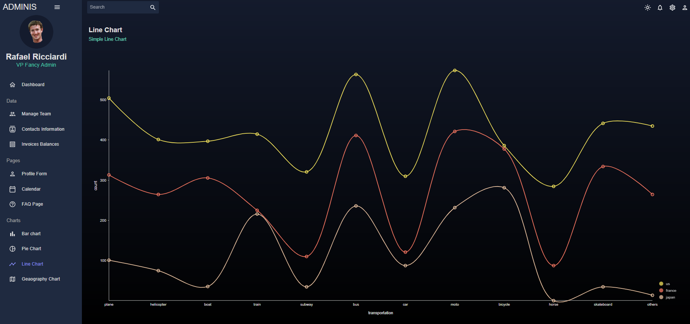
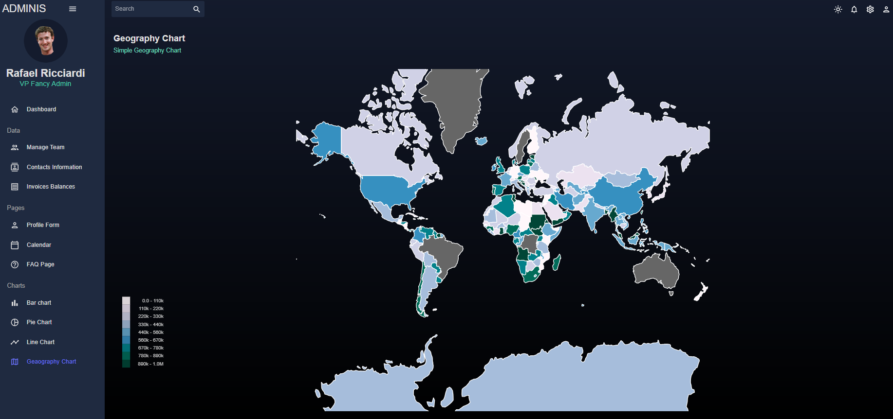

<h1 align="center"><strong>Admin Dashboard</strong></h1>

<br/>

<p align="center">
  
  
  
  
  
</p>

<br/>

<h3 align="center">
  <a href="#feature">Features</a>
  <a href="#pré-requisitos">Pré-requisitos</a>
  <a href="#tecnologia">Tecnologias</a>
  <a href="#autor">Autor</a>
</h3>

<br/>
<br/>
<br/>

## <strong>Sobre</strong>

Admin dashboard é um projeto para gerenciamento financero de uma empresa alimentícia. Neste projeto podemos gerenciar contatos (fornecedores e clientes), gerenciar colaboradores, criar e gerenciar eventos no calendário e visualizar algumas informações nos gráficos.
Este projeto utiliza a estrutura padrão do NextJS, componentes do Material-UI e estilização utilizando Tailwind CSS. Os gráficos são gerados a partir da biblioteca Nivo.

<br/>
<br/>

## <strong>Features</strong>

<br/>

### Home



### Team



### Contacts



### Invoices



### Profile Form



### Calendar



### FAQ



### Bar Chart



### Pie Chart


### Line Chart



### Geo Chart



<br/>
<br/>

## <strong>Pré-requisitos</strong>

Antes de começar você vai precisar ter instalados em sua máquiana as seguintes ferramentas:<br/>

- [x] [Git](https://git-scm.com)<br/>
- [x] [Node - v16 ou superior](https://nodejs.org/en)<br/>


Além disto é importante ter um editor para trabalhar com o código como [VSCode](https://code.visualstudio.com/)

### <strong>Como rodar a aplicação</strong>

```bash
# Clone o repositório
$ git clone https://github.com/ricciardi305/admin-dashboard.git

# Entre na raiz do projeto clonado
$ cd admin-dashboard

# Inicie o terminal e instale as dependências do projeto
$ npm install

# Inicie a aplicação
$ npm run dev

# Pronto! A aplicação está rodando em localhost na porta 3000 por padrão.
```

## <strong>Tecnologias</strong>

<br/>

- [x] [React](https://pt-br.reactjs.org/)<br/>
- [x] [NextJS](https://nextjs.org)<br/>
- [x] [Material UI](https://mui.com/material-ui/)<br/>
- [x] [Tailwind CSS](https://tailwindcss.com)<br/>
- [x] [Nivo Charts](https://nivo.rocks)<br/>

Para mais detalhes dessas e outras tecnologias utilizadas no frontend [package.json](feed/package.json)

<br/>

<br/>
<br/>

# Licença

Este projeto está sob a licença MIT License - Veja o arquivo [License](LICENSE) para mais detalhes.
<br/>
<br/>

# Autor

<br/>

<a href="https://github.com/ricciardi305">
    
    <br />
    <sub style="font-size: 16px"><b>Rafael Ricciardi</b></sub>
</a>

<br/>

> Feito com ❤️ por Rafael Ricciardi 👋🏽 Entre em contato!

[](https://www.linkedin.com/in/rafaelricciardi/)
